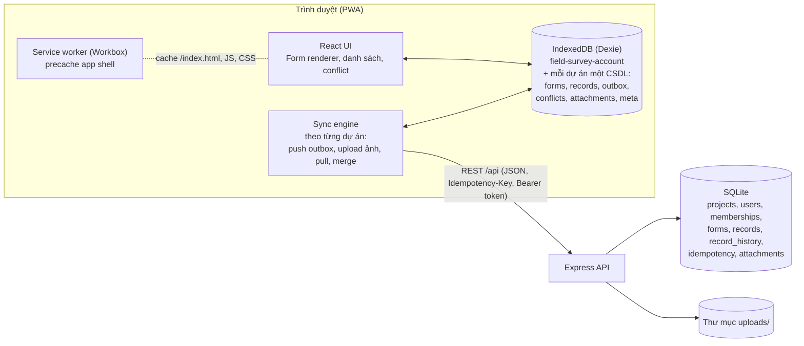
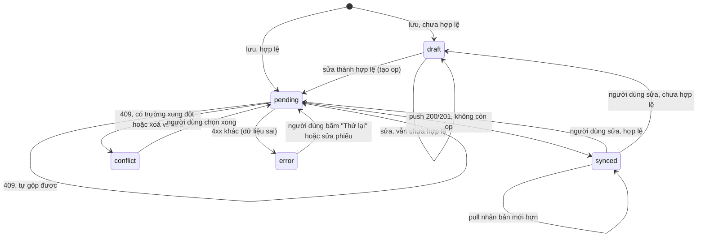

# Tài liệu thiết kế: Offline-first Field Survey PWA

- **Phiên bản:** 0.4.3 (2026-10-10)
- **Nhóm:** 3 sinh viên, 8 tuần. Phân công ở [team-plan.md](team-plan.md).
- **Quyết định kiến trúc (đã chấp nhận):** [ADR 0001 – Mô hình nhất quán](adr/0001-consistency-model.md), [ADR 0002 – Nhiều tổ chức](adr/0002-multi-tenancy.md)
- **Quy ước:** "Code chưa làm" nghĩa là spec đã chốt nhưng khung mã hiện tại chưa theo.
- **Phác thảo giao diện:** [ui.md](ui.md)

## Lịch sử thay đổi

| Phiên bản | Ngày | Thay đổi |
|---|---|---|
| 0.1 | 2026-10-07 | Bản đầu |
| 0.2 | 2026-10-07 | Thêm trạng thái nháp, sơ đồ trạng thái đầy đủ, khoá sửa khi đang xung đột, đồng bộ ảnh (§5.6), nhiều tab, phạm vi pull và vai trò, ràng buộc idempotency key, trình duyệt hỗ trợ, yêu cầu phi chức năng, triển khai, mã lỗi API, tiêu chí chấp nhận, thuật ngữ |
| 0.3 | 2026-10-07 | Chốt ADR 0001; phục vụ nhiều tổ chức theo ADR 0002: dự án, thành viên, vai trò `admin`, API theo dự án, mỗi dự án một IndexedDB, màn hình Dự án/Thành viên (§4.7); cắt builder kéo thả, so sánh ảnh, ZIP |
| 0.3.1 | 2026-10-09 | §9: route tiêm lỗi chuyển sang bật bằng `ENABLE_TEST_ROUTES=1` (TV3-01); §10: thêm unit test phía client |
| 0.4 | 2026-10-09 | Lấp chỗ hở trong spec: `createdBy` và tên người sửa trong `ServerRecord`/lịch sử (§6.2, §7), định dạng `GET /api/me` (§7), phân trang pull `hasMore` (§7), validate theo từng loại trường (§4.1), danh sách phiếu và bộ lọc (§4.8), đăng nhập mã khác khi còn dữ liệu (§4.7), xoá phiếu (§5.7), API tiêm lỗi đầy đủ (§10.1), cập nhật cấu trúc mã nguồn (§3); thêm [ui.md](ui.md). Các đề xuất chờ chốt liệt kê ở §14 |
| 0.4.1 | 2026-10-10 | Nhóm chốt P1, P2, P3, P5, P6, P8 (§14); bỏ nhãn "chờ chốt" ở §4.7, §5.7, §6.2, §7, §10.1 |
| 0.4.3 | 2026-10-10 | `FieldDef.hidden` và `validateRecord` đã có code (§4.1, §6.2; TV1-05 phần thuần). Số 0.4.2 dành cho PR #5 |

## Mục lục

1. Mục tiêu và phạm vi
2. Người dùng và kịch bản chính
3. Kiến trúc tổng quan
4. Thành phần
5. Đồng bộ
6. Mô hình dữ liệu
7. REST API
8. Xử lý lỗi
9. Bảo mật và quyền riêng tư
10. Kiểm thử
11. Yêu cầu phi chức năng
12. Triển khai
13. Rủi ro và hạn chế
14. Câu hỏi mở
15. Thuật ngữ

---

## 1. Mục tiêu và phạm vi

**Mục tiêu:** một hệ thống dùng chung cho **nhiều nhóm thuộc các tổ chức khác nhau** (y tế, nông nghiệp, giáo dục, ...). Mỗi nhóm tự tạo form cho lĩnh vực của mình; điều tra viên thu thập phiếu ở nơi không có mạng, dữ liệu tự đồng bộ khi có kết nối, và khi hai nơi cùng sửa một phiếu thì hệ thống giải thích rõ chuyện gì xảy ra để người dùng tự quyết. Dữ liệu của các nhóm tách biệt hoàn toàn (ADR 0002).

**Trong phạm vi (MVP)**

| Nhóm chức năng | Nội dung |
|---|---|
| Dự án và thành viên | Mỗi nhóm là một dự án có form, phiếu, ảnh và thành viên riêng. Một người thuộc được nhiều dự án với vai trò khác nhau; đổi dự án ngay trong app, kể cả khi offline. |
| Form builder | Tạo/sửa form với 7 loại trường: text, number, select, multiselect, date, photo, gps. Form có phiên bản, thuộc một dự án. |
| Offline storage | Form, phiếu, ảnh, hàng đợi đồng bộ trong IndexedDB (Dexie). App shell được service worker precache. |
| Sync queue | Outbox bền vững, retry với exponential backoff, idempotency key. |
| Attachments | Nén ảnh ở client, upload theo chunk, tiếp tục khi mất mạng giữa chừng. |
| Conflict UI | Merge theo trường, hiển thị ai sửa, lúc nào, giá trị gốc/của bạn/trên máy chủ. |
| Export | CSV (UTF-8 có BOM) và JSON theo từng dự án; ảnh xuất dạng URL. |

**Ngoài phạm vi:** đăng nhập SSO, tự đăng ký và mời qua email, tổ chức nhiều cấp, phân quyền chi tiết hơn 3 vai trò ở §9, logic điều kiện trong form, nhóm lặp (danh sách dòng trong phiếu), báo cáo/biểu đồ, cộng tác thời gian thực, ứng dụng native, nhiều tài khoản trên một máy, builder kéo thả (dùng nút lên/xuống), so sánh ảnh trong màn hình xung đột, xoá hoặc ngừng dùng form (form cũ vẫn hiện trong danh sách).

**Tiêu chí thành công (dùng để demo tuần 8)**
- Hai dự án mẫu (`demo-yte`, `demo-nongnghiep`) với form khác nhau; một người là điều tra viên ở dự án này và giám sát viên ở dự án kia, đổi qua lại khi offline, không thấy lẫn dữ liệu.
- Trên điện thoại thật qua HTTPS: tắt mạng hoàn toàn, mở app từ màn hình chính, tạo 10 phiếu có ảnh và GPS; bật mạng, tất cả phiếu **và ảnh** lên server, không trùng.
- Hai máy cùng sửa một phiếu khi offline: khác trường thì tự gộp; cùng trường thì hiện màn hình conflict dễ hiểu.
- Server lỗi 500 / timeout / mất mạng giữa lúc upload: dữ liệu vẫn lên đủ, đúng một lần.
- Đạt các chỉ tiêu hiệu năng ở §11 trên bộ dữ liệu mẫu 2.000 phiếu.

## 2. Người dùng và kịch bản chính

| Vai trò | Phạm vi | Nhu cầu |
|---|---|---|
| **Điều tra viên** (`surveyor`; dùng điện thoại, thường offline) | Theo dự án | Nhập nhanh, không mất dữ liệu, biết phiếu nào đã lên server |
| **Giám sát viên** (`supervisor`; thường online, máy tính hoặc điện thoại) | Theo dự án | Sửa phiếu sai, tạo/sửa form, xuất dữ liệu, quản lý thành viên dự án |
| **Quản trị** (`admin`) | Toàn hệ thống | Tạo dự án cho nhóm mới, chỉ định giám sát viên đầu tiên; không tự động đọc dữ liệu dự án |

Mọi vai trò dùng chính PWA này; màn hình nào hiện tuỳ vai trò trong dự án đang chọn (§4.7). Không làm trang quản trị riêng.

**Kịch bản**
0. *Mở nhóm mới:* quản trị tạo người dùng bằng CLI và gửi mã đăng nhập; tạo dự án, chỉ định giám sát viên. Giám sát viên thêm các điều tra viên vào dự án.
1. *Chuẩn bị:* giám sát viên tạo form. Điều tra viên nhập mã đăng nhập, mở app khi có Wi-Fi, app tải danh sách dự án và form, cài lên màn hình chính.
2. *Thực địa:* mất mạng; điều tra viên tạo phiếu, chụp ảnh, lấy GPS. Mỗi phiếu hiện nhãn "Chờ đồng bộ" (hoặc "Nháp" nếu thiếu trường bắt buộc).
3. *Về vùng có mạng:* app tự đồng bộ; nhãn đổi thành "Đã đồng bộ" khi cả phiếu và ảnh đã lên. Nếu giám sát viên đã sửa cùng phiếu, phiếu hiện "Cần xử lý xung đột".
4. *Xử lý xung đột:* màn hình liệt kê trường bị sửa ở cả hai nơi, người sửa và thời điểm; điều tra viên chọn giá trị giữ lại.
5. *Tổng hợp:* giám sát viên xuất CSV.

## 3. Kiến trúc tổng quan



**Nguyên tắc**
- **Local-first:** UI chỉ đọc/ghi IndexedDB, không bao giờ chờ mạng. Mạng là việc của sync engine chạy nền.
- **Một nguồn sự thật cho mỗi việc:** server quyết định thứ tự phiên bản; client giữ dữ liệu người dùng cho tới khi server xác nhận.
- **Cách ly theo dự án:** server lấy `projectId` chỉ từ đường dẫn đã qua kiểm tra thành viên; client mở riêng một CSDL cho mỗi dự án (ADR 0002).
- **Code dùng chung** (`shared/`): kiểu dữ liệu, thuật toán merge, backoff, để client và server không lệch nhau.

**Cấu trúc mã nguồn**

```
field-survey-pwa/
  shared/   kiểu dữ liệu, threeWayMerge, nextRetryDelay, validate form/phiếu (+ unit test)
  server/   Express + node:sqlite
            src/db.ts (migration), src/auth.ts (token, requireMember),
            src/repo/ (truy cập dữ liệu theo ctx), src/routes/ (me, admin, members, forms,
            records, attachments, export, faults), src/cli/ (user:*, seed:*); test/
  client/   React + Vite + Dexie + vite-plugin-pwa
            src/db (accountDb, projectDb), src/sync (api, engine, outbox, attachments),
            src/pages, src/components, src/media; e2e/
  docs/     design.md, ui.md, team-plan.md, vibe-coding.md, adr/, plan/
```

Các file trong `src/auth.ts`, `src/repo/`, `src/cli/`, `src/media/`, `accountDb`/`projectDb` chưa có; ticket tương ứng ở `docs/plan/` sẽ tạo.

## 4. Thành phần

### 4.1 Form builder và schema

Form là JSON (`FormSchema` trong `shared/src/types.ts`):

```json
{
  "id": "household-survey",
  "version": 1,
  "title": "Khảo sát hộ gia đình",
  "fields": [
    { "id": "householdName", "type": "text", "label": "Tên chủ hộ", "required": true },
    { "id": "waterSource", "type": "select", "label": "Nguồn nước", "options": ["Máy", "Giếng"] },
    { "id": "oldField", "type": "text", "label": "Trường cũ", "hidden": true }
  ]
}
```

- **Phiên bản hoá:** mỗi lần lưu form, server tạo dòng mới `(id, version+1)`, không sửa bản cũ. Bản ghi lưu `formVersion` và luôn hiển thị bằng đúng phiên bản đó.
- **Quy tắc đổi form an toàn:** được thêm trường, đổi nhãn, thêm option. Không đổi `id` hay `type` của trường đã có (tạo trường mới thay vì sửa). Không xoá trường khỏi mảng `fields`; muốn bỏ thì đặt `hidden: true` (`FieldDef.hidden`). Trường ẩn không hiện khi tạo phiếu mới nhưng vẫn có cột khi export.
- **Form thuộc một dự án;** `id` form chỉ cần duy nhất trong dự án. Muốn dùng lại form của dự án khác: xuất form ra JSON rồi nhập vào (nút "Xuất form"/"Nhập form" trong builder).
- **Validate ở server khi lưu form** (`POST /api/projects/:projectId/forms`, trả `400 invalid_form` kèm danh sách lỗi):
  - `id` trường duy nhất và khớp `^[a-zA-Z][a-zA-Z0-9_]*$`.
  - select/multiselect phải có ít nhất 1 option, option không trùng.
  - So với phiên bản trước: mọi trường cũ vẫn còn (có thể `hidden`), không đổi `type`, không bỏ option (option bỏ đi thì giữ lại, dữ liệu cũ vẫn hiển thị được).
- **Builder UI:** danh sách trường có nút lên/xuống để đổi thứ tự (không làm kéo thả), panel thuộc tính cho trường đang chọn, nút xem trước dùng chính `FormRenderer`.
- **Validate phiếu:** chạy ở client khi bấm Lưu (required, kiểu số, định dạng ngày). Phiếu không hợp lệ vẫn lưu được, ở trạng thái **nháp** (`draft`, xem §5.1): không tạo op trong outbox, không đồng bộ, hiện nhãn "Nháp" và danh sách lỗi khi mở lại. Lần lưu hợp lệ tiếp theo chuyển sang `pending` và tạo op.
- **Luật validate theo loại trường** (`validateRecord` trong `shared/`, chạy được cả ở server nếu cần). Trường `hidden` bỏ qua khi kiểm tra `required`.

  | Loại | Giá trị | "Có giá trị" (cho `required`) | Lỗi định dạng |
  |---|---|---|---|
  | `text` | `string` | sau khi bỏ khoảng trắng hai đầu còn ít nhất 1 ký tự | – |
  | `number` | `number` | khác `null` | không phải số hữu hạn (`NaN`, `Infinity`) |
  | `select` | `string` | khác `null` và `""` | không nằm trong `options` của đúng `formVersion` |
  | `multiselect` | `string[]` | mảng có ít nhất 1 phần tử | có phần tử không nằm trong `options` |
  | `date` | `string` `YYYY-MM-DD` | khác `null` và `""` | sai định dạng hoặc ngày không tồn tại (vd. `2026-02-30`) |
  | `gps` | `GpsValue` | khác `null` | `lat` ngoài `[-90, 90]` hoặc `lng` ngoài `[-180, 180]` |
  | `photo` | `string[]` (id ảnh) | mảng có ít nhất 1 id | – |

  Với `photo` bắt buộc: chỉ cần ảnh đã lưu trên máy là hợp lệ; ảnh chưa upload xong **không** làm phiếu thành nháp (việc upload là của §5.6). Option bị bỏ khỏi form ở phiên bản mới không làm phiếu cũ thành lỗi, vì phiếu luôn validate theo `formVersion` của chính nó.
- Phiếu đã từng lên server mà bị sửa thành không hợp lệ cũng thành `draft`: bản trên server giữ nguyên, thay đổi cục bộ được giữ và không bị pull ghi đè (ADR quy tắc 8).

**Tiêu chí chấp nhận**
- Giám sát viên tạo form 7 loại trường, lưu, điều tra viên thấy form sau lần đồng bộ kế tiếp.
- Sửa form (thêm trường, ẩn trường) tạo version mới; phiếu cũ vẫn mở bằng version cũ.
- Server từ chối form đổi `type` trường cũ hoặc thiếu trường cũ, trả `400 invalid_form`.
- Phiếu thiếu trường bắt buộc lưu được dạng nháp, không lên server.

### 4.2 Lưu trữ offline (IndexedDB)

Dexie, định nghĩa trong `client/src/db/db.ts`. Theo ADR 0002 có hai loại CSDL:

**`field-survey-account`** (một CSDL cho cả thiết bị)

| Bảng | Khoá | Nội dung |
|---|---|---|
| `account` | `key` | token, `userId`, tên, `isAdmin`, dự án đang chọn |
| `projects` | `id` | Bản sao `GET /api/me`: tên dự án, vai trò, trạng thái (`active` / `removed`), số phiếu cần xử lý và chưa đồng bộ (cập nhật sau mỗi vòng đồng bộ) |

**`field-survey-p-<projectId>`** (mỗi dự án một CSDL, cùng schema)

| Bảng | Khoá / index | Nội dung |
|---|---|---|
| `forms` | `key` = `id@version`, index `id` | Mọi phiên bản form đã tải |
| `records` | `id`, index `formId`, `syncState`, `updatedAt` | `data`, `deleted`, `baseData`, `baseVersion`, `syncState`, `validationErrors` |
| `outbox` | `++seq`, unique `opId`, index `recordId`, `nextAttemptAt` | Thao tác chờ gửi (§5.2) |
| `conflicts` | `recordId` | Bản server, lịch sử, kết quả merge chờ người dùng |
| `attachments` | `id`, index `recordId`, `uploadState`, `nextAttemptAt` | Blob ảnh, chunk đã upload, trạng thái retry (§5.6) |
| `meta` | `key` | `pull: { cursor, scope }`, ... |

- **Đổi dự án:** UI đóng CSDL cũ, mở CSDL của dự án mới; mọi `liveQuery` chỉ chạy trên CSDL đang mở, nên không thể hiển thị lẫn dữ liệu hai dự án.
- **Rút khỏi dự án:** xoá cả CSDL bằng `Dexie.delete`, chỉ khi không còn dữ liệu chưa gửi (ADR 0002 §6).

- **ID phía client:** `crypto.randomUUID()` cho phiếu và ảnh, nên tạo được khi offline và không đụng nhau.
- **Ghi nguyên tử:** lưu phiếu và thêm op vào outbox trong cùng một transaction Dexie (`saveRecordLocally`), không bao giờ có phiếu đã sửa mà thiếu op (trừ phiếu nháp, vốn không có op).
- **Nâng cấp schema:** thêm `this.version(n+1).stores(...).upgrade(...)`, không sửa version cũ. Mọi CSDL dự án dùng chung một lớp `ProjectDb` nên được nâng cấp giống nhau khi mở. CSDL `field-survey` của khung hiện tại không chuyển dữ liệu sang (chưa có người dùng thật), chỉ xoá.
- **Chống bị xoá dữ liệu:** gọi `navigator.storage.persist()` sau lần lưu phiếu đầu tiên; hiển thị dung lượng đã dùng qua `navigator.storage.estimate()` ở trang Cài đặt.

### 4.3 Service worker và cài đặt PWA

- `vite-plugin-pwa` chế độ `generateSW`.
- **Precache** toàn bộ app shell (HTML, JS, CSS, icon). Điều hướng bất kỳ (trừ `/api/`) trả `index.html` khi offline.
- **Runtime cache** `GET /api/projects/*/forms` và `GET /api/me` theo NetworkFirst (timeout 3s). Dữ liệu phiếu **không** cache qua SW vì nguồn là IndexedDB.
- **Cập nhật phiên bản app:** dùng `registerType: 'prompt'`: khi có SW mới, hiện thông báo "Có phiên bản mới, tải lại"; không tự reload khi người dùng đang nhập (khung hiện dùng `autoUpdate`, đổi ở tuần 4).
- **Đồng bộ nền:** sync engine chạy trong trang (§5.3). Background Sync API chỉ có trên Chromium nên là tuỳ chọn nâng cao, không phải yêu cầu.
- **Manifest:** tên "Khảo sát thực địa", `display: standalone`, icon SVG và icon PNG 192/512 (cần cho Android cũ và iOS).

### 4.4 Attachments (ảnh)

**Ở client**
1. Chọn/chụp ảnh qua `<input type="file" accept="image/*" capture="environment">`.
2. **Nén** bằng canvas: cạnh dài tối đa 1600px, JPEG chất lượng 0.8 (ảnh 4–6 MB còn khoảng 300–500 KB). Bỏ EXIF trừ hướng xoay.
3. Lưu Blob vào bảng `attachments`; giá trị trường photo là danh sách `attachmentId`.

**Upload theo chunk (resumable)**
- Mọi đường dẫn dưới đây có tiền tố `/api/projects/:projectId` (§7); ảnh thuộc dự án của phiếu chứa nó.
- Chunk 256 KB. Trước khi upload, `GET .../attachments/:id/status` để biết chunk nào server đã có, chỉ gửi phần thiếu.
- `PUT .../attachments/:id/chunks/:index` idempotent: gửi lại chunk đã có thì server trả 200, không ghi lại.
- Sau chunk cuối: `POST .../attachments/:id/complete { recordId, totalChunks, mimeType, sha256 }`; server ghép file, kiểm tra SHA-256 và magic bytes, trả `409 missing_chunks` nếu thiếu chunk, `422 checksum_mismatch` nếu sai hash.
- Thứ tự với bản ghi và cách retry: xem §5.6.
- Ảnh đã upload xong được giữ lại ở client cho tới khi người dùng dọn bộ nhớ, để xem offline.

### 4.5 Conflict UI

Khi sync engine nhận `409` và merge còn xung đột trường hoặc xung đột xoá/sửa, phiếu chuyển `conflict` và một dòng `conflicts` được lưu với: bản server, lịch sử các phiên bản sau `baseVersion`, kết quả merge.

**Màn hình xung đột** (`client/src/pages/ConflictPage.tsx`):
- Câu giải thích bằng ngôn ngữ thường: *"Trong lúc bạn ngoại tuyến, **Lan** đã sửa phiếu này (lần cuối 14:32 07/10). 2 trường đã được gộp tự động. Các trường dưới đây cả hai bên cùng sửa, hãy chọn giá trị giữ lại."*
- Bảng: tên trường (dùng nhãn trong form, không dùng `id`), giá trị trước đó, của bạn, trên máy chủ; mỗi dòng chọn một bên.
- Mục "Đã gộp tự động" thu gọn, mở ra thấy trường nào lấy từ đâu.
- **Xoá vs sửa:** hộp thoại riêng: "Bạn đã xoá phiếu này nhưng Lan vừa sửa nó. Giữ phiếu (với bản của Lan) hay vẫn xoá?" (và chiều ngược lại: "Lan đã xoá phiếu này nhưng bạn vừa sửa. Khôi phục với bản của bạn hay bỏ?"). Nút "Áp dụng" bị khoá cho tới khi người dùng trả lời câu này; không bao giờ mặc định chọn hộ.
- Multiselect và photo có thêm lựa chọn "Gộp cả hai" (hợp hai tập). Ảnh chỉ hiện số lượng mỗi bên ("3 ảnh" / "2 ảnh"); xem thumbnail so sánh để sau MVP.
- Sau khi áp dụng: dữ liệu đã chọn thành op mới với `baseVersion` = version server đã thấy, đẩy ngay. Nếu lại nhận `409` (server đổi tiếp trong lúc người dùng đang chọn), đi lại đúng quy trình ADR quy tắc 5 với base = bản server đã thấy: khác trường thì tự gộp, cùng trường thì hiện màn hình conflict mới.
- **Trong lúc phiếu đang `conflict`, không sửa được phiếu** (ADR quy tắc 7): mở phiếu thì ở chế độ chỉ đọc với banner "Phiếu này cần xử lý xung đột trước" và nút dẫn tới màn hình xung đột (code chưa làm).
- Danh sách phiếu có bộ lọc "Cần xử lý" và số đếm trên đầu trang.

**Tiêu chí chấp nhận:** đủ các ca C1–C8 ở §10.1.

### 4.6 Export

`GET /api/projects/:projectId/export/:formId?format=csv|json&includeDeleted=0` (chỉ `supervisor` của dự án)

- **CSV:** cột cố định `id, version, updatedAt, updatedBy, formVersion, deleted` rồi một cột mỗi trường của phiên bản form mới nhất, theo thứ tự trong form (kể cả trường `hidden`; trường chỉ có ở phiên bản cũ thêm vào cuối). Multiselect nối bằng `"; "`, gps tách `<field>_lat`, `<field>_lng`, `<field>_accuracy`, photo là các URL tuyệt đối nối bằng `"; "` (gốc lấy từ `PUBLIC_BASE_URL`). Mở đầu bằng BOM UTF-8 để Excel đọc đúng tiếng Việt. Escape theo RFC 4180. Ô bắt đầu bằng `= + - @` được thêm tiền tố `'` để tránh CSV injection.
- **JSON:** `{ forms: FormSchema[], records: ServerRecord[] }`, gồm mọi phiên bản form đã dùng.
- **Kèm ảnh:** ngoài phạm vi MVP (ADR 0002 cắt); nếu làm sau thì `format=zip` trả `data.csv` và thư mục `photos/<recordId>/<attachmentId>.jpg`, stream bằng `archiver`.
- Client có nút Xuất ở trang form (cần online).

**Tiêu chí chấp nhận**
- File CSV mở bằng Excel không lỗi font tiếng Việt; số dòng bằng số phiếu chưa xoá của dự án.
- Phiếu tạo bằng form v1 và v2 cùng nằm trong một file, cột khớp đúng.
- Không bao giờ có phiếu của dự án khác trong file.
- Có unit test cho escape (dấu phẩy, ngoặc kép, xuống dòng, ô bắt đầu bằng `=`).

### 4.7 Dự án và thành viên

Theo ADR 0002.

- **Bộ chọn dự án** ở thanh trên cùng: tên dự án đang chọn, mở ra thấy mọi dự án của mình kèm vai trò và số phiếu cần xử lý / chưa đồng bộ của từng dự án. Đổi dự án được khi offline với dự án đã tải.
- **Lần đầu mở app:** màn hình nhập mã đăng nhập. Sau đó nếu chỉ thuộc một dự án thì vào thẳng dự án đó; nếu chưa thuộc dự án nào: "Bạn chưa được thêm vào dự án nào. Gửi mã người dùng `<userId>` cho giám sát viên."
- **Màn hình Thành viên** (`supervisor`, cần online): danh sách thành viên và vai trò; thêm bằng `userId`; đổi vai trò; rút khỏi dự án (có hỏi xác nhận). Không cho tự rút giám sát viên cuối cùng.
- **Màn hình Dự án** (`admin`, cần online): tạo dự án, đổi tên, lưu trữ; chỉ định giám sát viên đầu tiên.
- **Bị rút khỏi dự án:** dự án hiện mờ trong bộ chọn với nhãn "Đã rời". Còn phiếu chưa gửi thì có banner "Bạn không còn thuộc dự án X. N phiếu chưa gửi được" với nút "Xuất JSON" và "Xoá khỏi máy".
- **Tạo người dùng** không có UI: quản trị chạy CLI ở server (§12).
- **Nhập mã của người khác trên máy đang có dữ liệu** (sau `401`, hoặc người dùng tự nhập lại):** sau khi `GET /api/me` trả về, so `user.id` mới với `userId` đang lưu trong `field-survey-account`.
  - Cùng người (mã được cấp lại bằng `user:rotate-token`): chỉ thay token, giữ nguyên mọi CSDL, đồng bộ tiếp.
  - Khác người và máy **không** còn dữ liệu chưa gửi ở mọi dự án (định nghĩa như `hasUnsentData`, ADR 0002 §6): xoá mọi CSDL dự án của người cũ rồi đăng nhập người mới.
  - Khác người và máy **còn** dữ liệu chưa gửi: từ chối, hiện "Máy này còn N phiếu chưa gửi của <tên người cũ>. Nhập lại mã của người đó để gửi, hoặc xuất JSON trước." kèm nút "Xuất JSON". Không có nút xoá ở bước này. Lý do: phiếu chưa gửi phải lên server dưới tên người tạo (bất biến 6), mà token người mới không gửi hộ được.
- **Đăng xuất** (trang Cài đặt) chỉ bật khi không còn dữ liệu chưa gửi ở mọi dự án; đăng xuất xoá token và mọi CSDL dự án.

**Tiêu chí chấp nhận:** đủ các ca T1–T10 ở ADR 0002.

### 4.8 Danh sách phiếu

Trang chủ của dự án đang chọn. Đọc từ IndexedDB (`liveQuery`), không gọi API.

- **Nhóm theo form**, mỗi form một mục có số phiếu; trong mục, phiếu sắp theo `updatedAt` cục bộ mới nhất trước.
- **Mỗi dòng:** tiêu đề phiếu (giá trị trường `text` đầu tiên không ẩn, rỗng thì "Phiếu chưa có tên"), nhãn trạng thái hiển thị (§5.1, §5.6), giờ sửa cuối. Với `supervisor` thêm tên người tạo (`createdByName`, kèm "(đã rời dự án)" nếu cần).
- **Bộ lọc:** trạng thái ("Tất cả", "Cần xử lý", "Chưa đồng bộ", "Nháp", "Lỗi"); với `supervisor` thêm lọc theo người tạo (cần `createdBy`, §6.2). Ô tìm kiếm theo tiêu đề phiếu. Bộ lọc chạy trên index `syncState` và lọc trong bộ nhớ, đủ cho 2.000 phiếu (§11.2).
- **Phiếu đã xoá** (`deleted`) không hiện trong danh sách mặc định.
- **Hiệu năng:** 2.000 phiếu phải cuộn mượt; nếu không đạt thì chỉ render phần đang thấy (tự viết, không thêm thư viện nếu chưa hỏi).
- Đầu trang: số "Cần xử lý" (§4.5) và cảnh báo phiếu tồn lâu (§5.2).

## 5. Đồng bộ

Chi tiết lý do ở [ADR 0001](adr/0001-consistency-model.md). Mã: `client/src/sync/engine.ts`, `client/src/sync/outbox.ts`, `server/src/routes/records.ts`.

### 5.1 Trạng thái phiếu

`syncState` của phiếu: `draft | pending | synced | conflict | error`.



- `conflict`: phiếu chỉ đọc cho tới khi giải quyết (§4.5).
- `error`: op ở trạng thái `failed`; sửa phiếu thì thay dữ liệu của op đó và đặt lại `queued`.
- Nhãn hiển thị tách khỏi `syncState`: phiếu `synced` nhưng còn ảnh chưa lên hiện "Đang tải ảnh (n)" (§5.6).

### 5.2 Outbox

Mỗi op: `{ seq, opId, recordId, data, deleted, attempts, nextAttemptAt, status, lastError }`.

| `status` | Ý nghĩa |
|---|---|
| `queued` | Chờ gửi (có thể đang trong thời gian backoff theo `nextAttemptAt`) |
| `failed` | Server trả 4xx không retry được; chờ người dùng sửa hoặc bấm "Thử lại" |

(Khung mã hiện có thêm `blocked` cho op tạo ra khi phiếu đang `conflict`; với quy tắc khoá sửa ở §4.5 trạng thái này không còn phát sinh và sẽ bị bỏ.)

- **Gộp op:** sửa phiếu khi op cuối của nó **chưa từng gửi** (`attempts = 0`) thì cập nhật op đó. Nếu op đã gửi ít nhất một lần (có thể server đã ghi nhưng response bị mất) thì giữ nguyên `opId` và thêm op mới phía sau. Nhờ vậy idempotency key không bao giờ bị dùng cho dữ liệu khác.
- **Thứ tự:** FIFO theo `seq`, tuần tự trong từng phiếu: op sau chỉ chạy khi op trước xong. Phiếu khác nhau không chặn nhau.
- `baseVersion` đọc từ phiếu **lúc gửi**, không lưu trong op, vì op trước thành công sẽ nâng `baseVersion`.
- **Op tồn lâu:** op `queued` có `attempts ≥ 5` hiện cảnh báo "Máy chủ đang lỗi, sẽ thử lại"; phiếu chưa lên server quá 24 giờ hiện cảnh báo ở đầu trang "Có n phiếu chưa đồng bộ hơn 1 ngày".

### 5.3 Vòng đồng bộ

`syncNow()` được gọi khi: app mở, sự kiện `online`, mỗi 30 giây, sau mỗi lần lưu, khi hết thời gian backoff. Các lần gọi chồng nhau trong cùng tab gộp làm một.

**Nhiều dự án:** đầu mỗi vòng gọi `GET /api/me` để cập nhật danh sách dự án và vai trò (offline thì dùng bản đã lưu), xử lý thay đổi thành viên theo ADR 0002 §6, rồi chạy các bước dưới cho từng dự án đang `active`, dự án đang chọn trước. Mọi đường dẫn dưới đây đều có tiền tố `/api/projects/:projectId`.

**Nhiều tab:** mỗi vòng đồng bộ (gồm mọi dự án) chạy trong `navigator.locks.request('field-survey-sync', { ifAvailable: true }, ...)`; tab không lấy được khoá thì bỏ qua lần đó. Nhờ vậy chỉ một tab gửi request tại một thời điểm (code chưa làm). Tab khác vẫn thấy kết quả ngay vì UI đọc IndexedDB qua `liveQuery`.

1. Offline thì dừng.
2. **Push:** với mỗi op đến hạn, `PUT .../records/:id` kèm `Idempotency-Key: opId`.
   - `200/201`: xoá op; `baseData = data trả về`, `baseVersion = version trả về`; hết op thì `synced`.
   - `409`: gộp mọi op của phiếu, three-way merge (base = `baseData`, local = `data` mới nhất, remote = bản server). Không xung đột thì thay bằng một op mới chứa bản gộp và cập nhật base; có xung đột thì lưu `conflicts`, phiếu thành `conflict`.
   - Lỗi mạng, timeout 10s, `5xx`, `408`, `429`: `attempts++`, `nextAttemptAt = now + nextRetryDelay(attempts)`.
   - `4xx` khác: op `failed`, phiếu `error`, hiển thị lỗi cho người dùng.
3. **Upload ảnh** (§5.6).
   - `403 not_member`: dừng dự án đó, đánh dấu `removed` (ADR 0002 §6).
4. **Pull:** `GET .../records?since=<cursor>` theo trang tới khi `hasMore = false` (§7); nếu `scope` trong response khác `scope` đã lưu thì đặt cursor về 0 trước; phiếu không có op chờ, không `draft` và không `conflict` thì ghi đè bằng bản server; lưu cursor mới.
5. **Form:** tải danh sách form mới nhất; tải thêm phiên bản form mà phiếu vừa pull về đang dùng nếu máy chưa có.
6. Hẹn giờ cho op hoặc ảnh sớm nhất đang trong backoff.

### 5.4 Backoff

`nextRetryDelay(n) = random trong [d/2, d]`, với `d = min(1s × 2^n, 5 phút)` (`shared/src/backoff.ts`, kiểu "equal jitter"). Jitter tránh mọi máy cùng retry khi server vừa sống lại. Nút "Đồng bộ" thủ công chạy ngay những op đã đến hạn.

### 5.5 Pull cursor và phạm vi

Server có bộ đếm toàn cục `seq`, tăng mỗi lần ghi bất kỳ phiếu nào; mỗi phiếu lưu `seq` lần ghi cuối. Pull trả phiếu **của dự án trong đường dẫn** có `seq > cursor`, sắp theo `seq`. Cách này không phụ thuộc đồng hồ thiết bị. Bộ đếm dùng chung cho mọi dự án là đủ, vì cursor chỉ cần tăng dần, không cần liên tục.

Điều kiện đúng: `seq` phải được cấp theo đúng thứ tự commit. SQLite đảm bảo điều này vì mọi transaction ghi chạy tuần tự (`BEGIN IMMEDIATE`). Xem §6.1 nếu đổi CSDL.

**Phạm vi pull theo vai trò trong dự án** (ADR 0002 §3):
- `surveyor`: chỉ nhận phiếu do chính mình tạo (`created_by` = người dùng của token). Giám sát viên sửa phiếu đó thì điều tra viên vẫn nhận được.
- `supervisor`: nhận mọi phiếu của dự án.

Response có `scope: 'own' | 'all'`. Client lưu cursor theo từng dự án kèm `scope`; vai trò đổi làm `scope` đổi thì cursor về 0 (ADR 0001 quy tắc 10).

Lý do: không tải dữ liệu cá nhân (tên chủ hộ, GPS, ảnh) của người khác về điện thoại, và giới hạn dung lượng mỗi máy. Hệ quả: hai điều tra viên cùng đến một hộ sẽ tạo hai phiếu riêng (trùng lặp nghiệp vụ, giám sát viên xử lý khi xuất), không phải xung đột. Xung đột thực tế chủ yếu là giữa điều tra viên và giám sát viên.

### 5.6 Đồng bộ ảnh

- **Hàng đợi:** chính bảng `attachments` (không dùng outbox), mỗi ảnh có `uploadState: 'pending' | 'uploading' | 'done' | 'failed'`, `attempts`, `nextAttemptAt`, `uploadedChunks`.
- **Thứ tự:** trong mỗi vòng, push phiếu trước, sau đó upload ảnh của những phiếu đã có trên server (`baseVersion > 0`), cũ trước mới sau, mỗi lần một ảnh. Server cho phép phiếu tham chiếu ảnh chưa xong; trang xem phiếu hiển thị "Ảnh đang tải lên".
- **Retry:** lỗi mạng, `5xx`, `408`, `429` dùng cùng `nextRetryDelay` như op; tiếp tục từ chunk thiếu theo `GET /status`.
- **Lỗi không retry được** (`413`, `415`, `422 checksum_mismatch` lần thứ hai): ảnh `failed`, phiếu hiện "Lỗi ảnh" kèm nút "Thử lại" và "Bỏ ảnh này".
- **Nhãn phiếu:** "Đã đồng bộ" chỉ khi `syncState = synced` **và** mọi ảnh của phiếu `done`. Ngược lại: "Đang tải ảnh (n)" hoặc "Lỗi ảnh".
- **Xoá ảnh khỏi phiếu:** chỉ bỏ id khỏi trường photo; blob cục bộ giữ tới khi người dùng dọn bộ nhớ.
- **Dọn rác ở server:** chunk tạm của ảnh chưa `complete` sau 7 ngày thì xoá. File đã hoàn tất không tự xoá, vì `record_history` có thể còn tham chiếu.

### 5.7 Xoá phiếu

Nút "Xoá phiếu" ở trang phiếu, luôn có hộp xác nhận "Xoá phiếu này? Không hoàn tác được trên máy." (bất biến 1: người dùng đã bấm xác nhận). Surveyor xoá được phiếu mình tạo, supervisor xoá được mọi phiếu. Phiếu đang `conflict` không xoá được (chỉ đọc, §4.5). Hàm xoá nằm cạnh `saveRecordLocally` và chạy trong **một transaction Dexie** gồm `records`, `outbox`, `attachments`.

| Phiếu đang ở đâu | Cách nhận biết | Hành vi |
|---|---|---|
| Chưa bao giờ có thể đã tới server | `baseVersion = 0` và mọi op của phiếu có `attempts = 0` (kể cả phiếu nháp không có op) | Xoá hẳn trên máy: xoá phiếu, mọi op, mọi ảnh của phiếu. Không gửi gì lên server |
| Có thể đã tới server | `baseVersion > 0`, hoặc có op đã gửi ít nhất một lần (server có thể đã ghi mà mất response) | Đặt `deleted = true`, tạo op xoá theo quy tắc gộp §5.2 (op chưa gửi thì sửa op đó, op đã gửi thì thêm op mới phía sau). Phiếu biến khỏi danh sách; giữ trong IndexedDB tới khi op xoá được server xác nhận |

- **Dữ liệu trong op xoá:** `deleted: true`, `data` = dữ liệu hợp lệ mới nhất (`baseData` nếu phiếu đang là nháp), để server không nhận dữ liệu chưa qua validate.
- **Xung đột:** server đã có người sửa trong lúc mình xoá thì nhận `409` và đi theo ADR 0001 quy tắc 6 (hỏi giữ hay xoá, §4.5). Không tự quyết.
- **Ảnh của phiếu đã xoá:** ngừng upload; blob chưa upload được xoá cùng lúc op xoá được server xác nhận.
- Khôi phục phiếu đã xoá (bỏ tombstone) ngoài phạm vi MVP, trừ trường hợp người dùng chọn "Khôi phục" trong màn hình xung đột.

## 6. Mô hình dữ liệu

### 6.1 Server (SQLite, `server/src/db.ts`)

| Bảng | Cột chính | Ghi chú |
|---|---|---|
| `projects` | `id`, `name`, `archived`, `created_at` | ADR 0002 |
| `users` | `id`, `name`, `token_hash`, `is_admin`, `disabled`, `created_at` | Token chỉ lưu SHA-256 |
| `memberships` | `project_id`, `user_id`, `role`, `added_at` | PK `(project_id, user_id)`; `role` ∈ `surveyor`, `supervisor` |
| `forms` | `project_id`, `id`, `version`, `schema` (JSON), `created_at`, `created_by` | PK `(project_id, id, version)` |
| `records` | `id`, `project_id`, `form_id`, `form_version`, `data` (JSON), `version`, `deleted`, `created_by`, `updated_at`, `updated_by`, `seq` | Bản hiện tại; `id` duy nhất toàn hệ thống; index `(project_id, seq)`, `(project_id, created_by, seq)` |
| `record_history` | `record_id`, `version`, `data`, `deleted`, `updated_at`, `updated_by` | Mọi phiên bản; dự án suy ra từ `records` |
| `idempotency` | `key`, `project_id`, `record_id`, `request_hash`, `status`, `body`, `created_at` | Response đã lưu; dọn sau 30 ngày |
| `attachments` *(sẽ thêm)* | `id`, `project_id`, `record_id`, `mime_type`, `size`, `sha256`, `total_chunks`, `created_by`, `created_at`, `completed_at` | File nằm ở `uploads/<projectId>/` |
| `meta` | `k`, `v` | Bộ đếm `seq` |

Mọi truy vấn dữ liệu dự án đi qua lớp truy cập nhận `ctx = { userId, projectId, role }` bắt buộc (ADR 0002 §3). Các bảng và cột mới ở bản 0.2–0.3 code chưa làm.

**Nếu đổi sang Postgres:** phần lớn SQL dùng lại được, nhưng cursor `seq` **không** còn đúng nếu chỉ dùng sequence: hai transaction song song có thể commit ngược thứ tự `seq`, và client pull giữa hai lần commit sẽ bỏ sót phiếu. Cần tuần tự hoá việc ghi (`pg_advisory_xact_lock` trên một khoá chung, đủ cho quy mô đồ án) hoặc đổi sang cursor dựa trên transaction id. Không nằm trong phạm vi 8 tuần.

### 6.2 Kiểu dùng chung

Định nghĩa ở `shared/src/types.ts`: `FormSchema`, `FieldDef` (thêm `hidden?: boolean`), `FieldValue`, `ServerRecord`, `RecordHistoryEntry`, `PushRecordRequest` (bỏ `updatedBy`), `ConflictResponse`, `PullResponse` (thêm `scope`, `hasMore`), `ApiError`, `Role`, `MeResponse`, `ProjectSummary`, `Member`.

**Thay đổi ở bản 0.4:**

```ts
interface ServerRecord {
  id: string; formId: string; formVersion: number;
  data: RecordData; version: number; deleted: boolean;
  createdBy: string;       // userId người tạo (mới)
  createdByName: string;   // tên người tạo lúc đọc (mới)
  updatedAt: string;       // ISO 8601 UTC do server gán
  updatedBy: string;       // userId người sửa cuối
  updatedByName: string;   // tên người sửa cuối lúc đọc (mới)
}

interface RecordHistoryEntry {
  version: number; data: RecordData; deleted: boolean;
  updatedAt: string; updatedBy: string;
  updatedByName: string;   // mới
}
```

- **Vì sao gửi kèm tên:** màn hình xung đột cần hiện "**Lan** đã sửa…" (§4.5) ngay cả khi offline, và surveyor không được gọi `GET P/members`. Server ghép tên từ bảng `users` lúc trả response; client lưu theo bản ghi nên đọc được khi offline. Tên đổi sau đó thì bản đã tải về vẫn hiện tên cũ tới lần pull kế tiếp, chấp nhận được.
- **"(đã rời dự án)":** client tự thêm khi `createdBy` không có trong danh sách thành viên mà supervisor tải được; surveyor không cần (chỉ thấy phiếu của chính mình).
- `updatedAt` là ISO 8601 UTC; UI hiển thị theo múi giờ của máy, chỉ để đọc, không dùng để so thứ tự (bất biến 4).

## 7. REST API

Base `/api`, JSON. Mọi request trừ `/health` cần `Authorization: Bearer <token>` (§9). Route theo dự án nằm dưới `/api/projects/:projectId` (viết tắt `P` trong bảng) và đi qua middleware kiểm tra thành viên (ADR 0002 §3). Code hiện tại dùng đường dẫn không có `P` và chưa có xác thực.

**Không theo dự án**

| Method | Đường dẫn | Mô tả | Vai trò | Trạng thái |
|---|---|---|---|---|
| GET | `/health` | Kiểm tra sống | – | Có |
| GET | `/me` | Người dùng hiện tại và danh sách dự án kèm vai trò | mọi | TODO TV2 |
| GET/POST | `/admin/projects` | Liệt kê / tạo dự án | admin | TODO TV2 |
| PATCH | `/admin/projects/:projectId` | Đổi tên, lưu trữ | admin | TODO TV2 |
| PUT | `/admin/projects/:projectId/members/:userId` | Chỉ định giám sát viên | admin | TODO TV2 |
| POST/DELETE | `/__test/faults` | Tiêm lỗi cho kiểm thử | – | Có; chỉ khi `ENABLE_TEST_ROUTES=1` |

**Theo dự án** (`P` = `/projects/:projectId`)

| Method | Đường dẫn | Mô tả | Vai trò | Trạng thái |
|---|---|---|---|---|
| GET | `P/members` | Danh sách thành viên | supervisor | TODO TV1 |
| PUT | `P/members/:userId` | Thêm hoặc đổi vai trò `{ role }` | supervisor | TODO TV1 |
| DELETE | `P/members/:userId` | Rút khỏi dự án (không rút được giám sát viên cuối cùng) | supervisor | TODO TV1 |
| GET | `P/forms` | Phiên bản mới nhất của mỗi form | thành viên | Có (chưa theo dự án) |
| GET | `P/forms/:id/versions/:v` | Một phiên bản form | thành viên | Có (chưa theo dự án) |
| POST | `P/forms` | Lưu form từ builder, tự tăng version | supervisor | TODO TV1 |
| GET | `P/records?since=&limit=` | Pull theo cursor, lọc theo phạm vi §5.5; trả thêm `scope` | thành viên | Có (chưa lọc) |
| GET | `P/records/:id/history` | Lịch sử phiên bản | thành viên (trong phạm vi) | Có |
| PUT | `P/records/:id` | Ghi có điều kiện, cần `Idempotency-Key` | thành viên (trong phạm vi) | Có |
| GET | `P/attachments/:id/status` | Chunk đã nhận | thành viên | TODO TV3 |
| PUT | `P/attachments/:id/chunks/:i` | Upload một chunk (`application/octet-stream`, ≤ 256 KB) | thành viên | TODO TV3 |
| POST | `P/attachments/:id/complete` | Ghép file, kiểm SHA-256 | thành viên | TODO TV3 |
| GET | `P/attachments/:id` | Tải ảnh | thành viên (trong phạm vi) | TODO TV3 |
| GET | `P/export/:formId?format=` | Xuất CSV/JSON | supervisor | TODO TV3 |

**PUT /api/projects/:projectId/records/:id**

```http
PUT /api/projects/demo-yte/records/3f2c... HTTP/1.1
Authorization: Bearer <token>
Idempotency-Key: 9b1e...
Content-Type: application/json

{ "formId": "household-survey", "formVersion": 1, "baseVersion": 2,
  "data": { "householdName": "An", "members": 4 }, "deleted": false }
```

`updatedBy` không còn trong thân request; server lấy từ token.

| Kết quả | Thân |
|---|---|
| `201` tạo mới / `200` cập nhật | `ServerRecord` |
| `409 version_conflict` | `{ error, current: ServerRecord, history: RecordHistoryEntry[] }` |
| `400` | thiếu `Idempotency-Key` hoặc thân sai |
| `403 not_member` | không (còn) là thành viên dự án |
| `404` | `baseVersion > 0` nhưng phiếu không tồn tại, phiếu ngoài phạm vi của surveyor, hoặc `id` thuộc dự án khác |
| `422 idempotency_key_reused` | key đã dùng cho request khác (khác dự án, khác `recordId` hoặc khác nội dung) |

**GET /api/me**

```json
{
  "user": { "id": "u_7f3a...", "name": "Lan", "isAdmin": false },
  "projects": [
    { "id": "demo-yte", "name": "Y tế xã Tân Lập", "role": "supervisor" },
    { "id": "demo-nongnghiep", "name": "HTX Nông nghiệp", "role": "surveyor" }
  ]
}
```

- Chỉ chứa dự án người dùng **đang** là thành viên và chưa lưu trữ. Dự án bị rút hoặc bị lưu trữ đơn giản là biến khỏi danh sách; client so với bản đã lưu để biết (ADR 0002 §6) và tự gắn trạng thái `removed` ở `field-survey-account`.
- `401 unauthorized` khi thiếu token, token sai hoặc tài khoản `disabled`.
- Kiểu: `MeResponse { user: { id; name; isAdmin }; projects: ProjectSummary[] }`, `ProjectSummary { id; name; role: Role }`.

**GET /api/projects/:projectId/records?since=&limit=** (pull)

```json
{ "records": [ /* ServerRecord, sắp theo seq tăng dần */ ], "cursor": 1234, "hasMore": true, "scope": "own" }
```

- `since` mặc định `0`; `limit` mặc định 500, tối đa 1000.
- `cursor` = `seq` của bản ghi cuối trong trang (bằng `since` nếu trang rỗng). Client gọi tiếp với `since = cursor` cho tới khi `hasMore = false`, và lưu cursor **sau mỗi trang** để mất mạng giữa chừng thì lần sau đi tiếp, không tải lại từ đầu.
- `hasMore` = còn bản ghi có `seq > cursor` trong phạm vi (server lấy `limit + 1` dòng để biết).
- Gồm cả tombstone (`deleted: true`) để máy khác biết phiếu đã bị xoá.

### 7.1 Mã lỗi

Dạng chung: `{ "error": "<mã>", "message"?: "<mô tả cho người phát triển>", "details"?: ... }`.

| HTTP | `error` | Khi nào | Client xử lý |
|---|---|---|---|
| 400 | `invalid_body` | Thân request sai kiểu | op `failed` |
| 400 | `missing_idempotency_key` | Thiếu header | lỗi lập trình, op `failed` |
| 400 | `invalid_form` | Form không qua validate (`details`: danh sách lỗi) | hiện lỗi trong builder |
| 401 | `unauthorized` | Thiếu hoặc sai token | dừng đồng bộ, yêu cầu nhập lại token |
| 403 | `not_member` | Không (còn) là thành viên dự án, hoặc dự án đã lưu trữ | dừng dự án, xử lý như bị rút (ADR 0002 §6) |
| 403 | `forbidden` | Là thành viên nhưng sai vai trò (vd. surveyor gọi export) | hiện lỗi; ẩn nút tương ứng |
| 404 | `not_found` | Không có tài nguyên, ngoài phạm vi, hoặc thuộc dự án khác (không phân biệt để không lộ thông tin) | op `failed` |
| 409 | `last_supervisor` | Rút hoặc hạ vai trò giám sát viên cuối cùng | hiện lỗi |
| 409 | `version_conflict` | `baseVersion` lệch | merge (§5.3) |
| 409 | `missing_chunks` | `complete` khi còn thiếu chunk (`details`: chỉ số thiếu) | upload phần thiếu |
| 413 | `payload_too_large` | Chunk hoặc ảnh quá giới hạn | ảnh `failed` |
| 415 | `unsupported_media_type` | Không phải JPEG/PNG/WebP | ảnh `failed` |
| 422 | `idempotency_key_reused` | Xem trên | op `failed` (lỗi lập trình) |
| 422 | `checksum_mismatch` | SHA-256 không khớp | upload lại từ đầu một lần, sau đó `failed` |
| 501 | `not_implemented` | Route chưa làm | – |
| 500 / 400 | `injected_fault` | Lỗi do route tiêm lỗi tạo ra (§10.1), chỉ khi `ENABLE_TEST_ROUTES=1` | như mã HTTP tương ứng |
| 5xx | `internal_error` | Lỗi server | retry theo backoff |

## 8. Xử lý lỗi

| Tình huống | Hành vi | Người dùng thấy |
|---|---|---|
| Offline | Không gửi; chờ sự kiện `online` | Nhãn "Ngoại tuyến", phiếu "Chờ đồng bộ" |
| Timeout / mất kết nối giữa chừng | Retry với cùng `opId`; server trả lại response cũ nếu đã ghi | Không thấy gì khác |
| `5xx`, `429` | Backoff, retry | Sau 5 lần: "Máy chủ đang lỗi, sẽ thử lại" (code chưa làm) |
| `401` | Dừng đồng bộ | "Phiên đăng nhập hết hạn, nhập lại mã" |
| `403 not_member` | Dừng dự án đó | "Bạn không còn thuộc dự án X" (§4.7) |
| `409` gộp được | Tự gộp, gửi lại | Không thấy gì |
| `409` có xung đột | Chờ người dùng; phiếu chỉ đọc | "Cần xử lý xung đột" |
| `4xx` khác | Dừng op | "Lỗi" kèm chi tiết, nút "Thử lại" và "Xuất JSON phiếu này" |
| Ảnh lỗi không retry được | Dừng ảnh đó | "Lỗi ảnh", nút "Thử lại" / "Bỏ ảnh này" |
| IndexedDB đầy (`QuotaExceededError`) | Không lưu ảnh mới | "Bộ nhớ đầy: đồng bộ rồi dọn ảnh đã tải lên" |
| Phiếu dùng form version chưa có trên máy | Pull form version đó | Nếu offline: "Cần kết nối để mở phiếu này" |
| Phiếu chưa đồng bộ quá 24 giờ | Không đổi hành vi | Cảnh báo đầu trang (§5.2) |

## 9. Bảo mật và quyền riêng tư

Phạm vi đồ án giữ đơn giản:
- **Xác thực:** mỗi người dùng một token dài ngẫu nhiên, tạo bằng CLI ở server (§12), server chỉ lưu SHA-256 trong bảng `users`. Client nhập token một lần ở màn hình đầu tiên, lưu trong `field-survey-account`, gửi qua `Authorization: Bearer`. `updatedBy` và `created_by` lấy từ token, không để client tự khai. Hiện khung dùng tên nhập tay, cần thay ở tuần 2. Mất máy: quản trị đổi token bằng `user:rotate-token`.
- **Phân quyền** (ADR 0002 §2): `admin` quản lý dự án nhưng không đọc dữ liệu dự án nếu không là thành viên; trong mỗi dự án, `surveyor` chỉ đọc/ghi phiếu mình tạo (§5.5), `supervisor` đọc/ghi mọi phiếu, tạo form, xuất dữ liệu, quản lý thành viên.
- **Cách ly dự án:** `projectId` chỉ lấy từ đường dẫn sau khi kiểm tra thành viên; id thuộc dự án khác trả `404`; bộ test T1–T5 (ADR 0002) chạy trong CI.
- **HTTPS bắt buộc** khi triển khai (service worker chỉ chạy trên HTTPS hoặc localhost).
- **CORS:** chỉ cho phép origin của app (`CORS_ORIGIN`), không mở `*`.
- **Dữ liệu trên máy:** IndexedDB không mã hoá; ghi rõ trong tài liệu người dùng, có nút "Xoá dữ liệu trên máy" (chỉ bật khi outbox rỗng và mọi ảnh đã `done`).
- **Upload:** giới hạn chunk 256 KB và ảnh 10 MB, kiểm tra MIME bằng magic bytes, tên file do server đặt.
- **Route tiêm lỗi** chỉ bật khi đặt rõ `ENABLE_TEST_ROUTES=1` (bật chủ động; quên cấu hình thì route tắt).
- **CSV injection:** escape ô bắt đầu bằng `= + - @` (§4.6).
- GPS là dữ liệu cá nhân: chỉ lấy khi người dùng bấm, không chạy nền; không tải phiếu của người khác về máy điều tra viên (§5.5).

## 10. Kiểm thử

| Mức | Công cụ | Vị trí | Chạy |
|---|---|---|---|
| Unit | Vitest | `shared/src/*.test.ts`, `client/src/**/*.test.ts` (hàm thuần phía client) | `npm test` |
| Integration API | Vitest + `fetch` vào server chạy cổng ngẫu nhiên, SQLite in-memory | `server/test/` | `npm test` |
| E2E | Playwright trên bản build (`vite preview`) để SW chạy như thật | `client/e2e/` | `npm run test:e2e` |
| Hiệu năng | Script seed 2.000 phiếu + Playwright đo thời gian | `client/e2e/perf/` | thủ công, tuần 6 |

### 10.1 Ma trận E2E bắt buộc

**Offline**

| # | Ca | Trạng thái |
|---|---|---|
| O1 | Tải app, offline, reload vẫn mở được, nhập phiếu, online thì đồng bộ | Có (`offline.spec.ts`) |
| O2 | Offline từ lúc mở app (đã cài trước đó), tạo 10 phiếu, online | TODO |
| O3 | Phiếu có ảnh khi offline, online thì ảnh lên đủ, nhãn chỉ thành "Đã đồng bộ" khi ảnh xong | TODO |
| O4 | Đóng tab khi còn op, mở lại thì vẫn đồng bộ | TODO |
| O5 | Lưu phiếu thiếu trường bắt buộc: thành "Nháp", không lên server; sửa đủ thì đồng bộ | TODO |
| O6 | Hai tab cùng mở: mỗi op chỉ được gửi từ một tab | TODO |

**Conflict**

| # | Ca | Kỳ vọng | Trạng thái |
|---|---|---|---|
| C1 | Hai nơi sửa khác trường | Tự gộp, không hỏi | Unit có; E2E TODO |
| C2 | Hai nơi sửa cùng trường, khác giá trị | Màn hình conflict, chọn xong server có bản gộp | Có (`conflict.spec.ts`) |
| C3 | Hai nơi sửa cùng trường, cùng giá trị | Không hỏi | Unit có |
| C4 | Máy xoá, server sửa | Hỏi giữ hay xoá; nút Áp dụng khoá tới khi trả lời | Unit có; UI TODO |
| C5 | Máy sửa, server xoá | Hỏi khôi phục hay bỏ | Unit có; UI TODO |
| C6 | Sửa ba lần liên tiếp khi offline | Một op, version server tăng 1 | TODO |
| C7 | Phiếu đang conflict, người dùng mở phiếu | Chỉ đọc, có banner dẫn tới màn hình xung đột; không tạo op | TODO |
| C8 | Server đổi tiếp trong lúc người dùng đang chọn ở màn hình conflict | Khác trường: tự gộp; cùng trường: hiện conflict mới; không mất lựa chọn đã áp dụng | TODO |

**Retry**

| # | Ca | Kỳ vọng | Trạng thái |
|---|---|---|---|
| R1 | Server trả 500 hai lần | Retry theo backoff, đúng một bản ghi | Có (`offline.spec.ts`) |
| R2 | Timeout (server giữ request 15s) | Hủy sau 10s, retry, không trùng | TODO (dùng `mode: "timeout"`) |
| R3 | Server ghi xong nhưng kết nối bị cắt trước response | Gửi lại cùng key, server trả `Idempotent-Replayed` | Integration có; E2E TODO (`mode: "drop"` cần sửa để cắt **sau** khi ghi) |
| R4 | Mất mạng giữa lúc upload ảnh | Tiếp tục từ chunk thiếu | TODO |
| R5 | `400` | Phiếu "Lỗi", không retry vô hạn | TODO |
| R6 | Cùng `Idempotency-Key`, khác nội dung | `422 idempotency_key_reused` | Integration TODO |

**Phân quyền** (integration)

| # | Ca | Kỳ vọng | Trạng thái |
|---|---|---|---|
| A1 | Không có token | `401` | TODO |
| A2 | Surveyor pull | Chỉ nhận phiếu mình tạo | TODO |
| A3 | Surveyor gọi `POST P/forms` hoặc export | `403 forbidden` | TODO |
| A4 | Rút hoặc hạ giám sát viên cuối cùng | `409 last_supervisor` | TODO |

**Cách ly dự án và thay đổi thành viên:** ca T1–T10 ở [ADR 0002](adr/0002-multi-tenancy.md#kiểm-chứng) (T1–T5 integration, T6–T10 E2E). Fixture chung: hai dự án, ba người dùng (một chỉ ở dự án A, một ở cả hai với vai trò khác nhau, một admin không là thành viên).

**API kiểm thử** (chỉ đăng ký khi `ENABLE_TEST_ROUTES=1`, file `server/src/routes/faults.ts`):

| Method | Đường dẫn | Thân / kết quả |
|---|---|---|
| POST | `/api/__test/faults` | `{ "mode", "count", "match"?, "chunkIndex"? }`: `count` request khớp tiếp theo bị lỗi |
| DELETE | `/api/__test/faults` | Tắt mọi lỗi đang chờ |
| GET | `/api/__test/stats` | `{ "requests": [{ "method", "path", "idempotencyKey"?, "status" }] }`: nhật ký request kể từ lần reset |
| DELETE | `/api/__test/stats` | Xoá nhật ký |

| `mode` | Hành vi | Dùng cho |
|---|---|---|
| `"500"` | Không vào handler, trả `500 { error: 'injected_fault' }` | R1 |
| `"400"` | Không vào handler, trả `400 { error: 'injected_fault' }` | R5 |
| `"timeout"` | Giữ request 15 s rồi mới cho vào handler | R2 |
| `"drop"` | Cho vào handler, handler ghi xong thì huỷ socket thay vì gửi response | R3 |
| `"drop-before"` | Huỷ socket trước khi vào handler (hành vi `drop` của khung hiện tại) | mất mạng thuần |

- `match`: tiền tố đường dẫn **sau** `/api/projects/:projectId`, mặc định `"/records"`. Ví dụ `"/attachments"` để tiêm lỗi vào upload ảnh.
- `chunkIndex`: chỉ áp lỗi cho `PUT .../chunks/<chunkIndex>`, phục vụ R4 (cắt ở chunk thứ 2 thì `chunkIndex: 1`).
- Nhật ký `stats` chỉ ghi request dưới `/api/projects/`; dùng để kiểm "đúng một PUT cho mỗi `opId`" (O6) và "mỗi chunk chỉ ghi một lần" (R4).
- Khi thêm `mode` mới thì thêm vào bảng này cùng PR.

Playwright `context.setOffline(true|false)` để bật/tắt mạng. Các test chạy tuần tự (`workers: 1`) vì dùng chung server. Khi chạy local, Playwright dùng lại server đang chạy ở cổng 3001 nếu có (`reuseExistingServer`); tắt `npm run dev` trước khi chạy E2E để không ghi vào DB thật.

### 10.2 CI

GitHub Actions: `npm ci`, `npm run typecheck`, `npm test`, `npx playwright install --with-deps chromium`, `npm run test:e2e`. Lưu `playwright-report/` làm artifact khi fail.

## 11. Yêu cầu phi chức năng

### 11.1 Trình duyệt và thiết bị hỗ trợ

| Nền tảng | Tối thiểu | Ghi chú |
|---|---|---|
| Android, Chrome | 120 | Nền tảng chính cho điều tra viên; thiết bị tham chiếu: máy tầm trung 3 GB RAM |
| iOS/iPadOS, Safari | 16.4 | Phải "Thêm vào màn hình chính" (§13); `storage.persist()` chỉ có từ 17 |
| Máy tính, Chrome/Edge | 120 | Cho giám sát viên |
| Firefox, Safari macOS | best-effort | Không chạy E2E |

Các API bắt buộc: Service Worker, IndexedDB, `crypto.randomUUID`, Web Locks, `crypto.subtle` (SHA-256). Nếu trình duyệt thiếu, app hiện thông báo "Trình duyệt không được hỗ trợ" thay vì chạy sai.

### 11.2 Chỉ tiêu

| Chỉ tiêu | Mục tiêu | Đo bằng |
|---|---|---|
| Mở app offline (đã cài) tới khi nhập được | ≤ 3 s trên thiết bị tham chiếu | Playwright, CPU throttle 4× |
| Lưu một phiếu | ≤ 200 ms | Playwright |
| Danh sách 2.000 phiếu | Cuộn mượt, hiển thị ≤ 1 s | Thủ công |
| Đồng bộ 100 phiếu không ảnh | ≤ 10 s ở mạng "Slow 3G" | Playwright network throttle |
| Đồng bộ 50 ảnh đã nén | ≤ 3 phút ở mạng 3G (1,6 Mbps) | Playwright network throttle |
| Pull lần đầu 5.000 phiếu (supervisor) | ≤ 30 s | Script seed |
| Dung lượng mỗi máy | Thiết kế cho tổng 2.000 phiếu + 500 ảnh (khoảng 250 MB) trên mọi dự án | `storage.estimate()` |
| Đổi dự án (đã tải) | ≤ 1 s, kể cả offline | Playwright |
| Số dự án mỗi người dùng | Tối đa 10 | Thiết kế |
| Kích thước ảnh sau nén | ≤ 600 KB | Unit test hàm nén |

## 12. Triển khai

- **Một tiến trình Node** phục vụ API; bản build client (`client/dist`) do reverse proxy phục vụ, cùng origin với `/api` (không cần CORS ở production).
- **HTTPS:** demo trên điện thoại thật cần HTTPS. Từ tuần 2 có môi trường staging: VPS hoặc máy nhóm, Caddy tự cấp chứng chỉ, hoặc Cloudflare Tunnel. Phụ trách: TV1 (xem team-plan).

**Biến môi trường (server)**

| Biến | Mặc định | Ý nghĩa |
|---|---|---|
| `PORT` | `3001` | Cổng API |
| `DB_PATH` | `data/survey.db` | File SQLite; `:memory:` cho test |
| `UPLOAD_DIR` | `uploads` | Thư mục ảnh (con theo `projectId`) |
| `PUBLIC_BASE_URL` | `http://localhost:3001` | Gốc URL ảnh trong CSV |
| `CORS_ORIGIN` | (không đặt = tắt CORS) | Origin được phép khi client và API khác origin (dev) |
| `ENABLE_TEST_ROUTES` | không đặt | `1` để bật `/api/__test/*` |

**Lệnh quản trị (CLI, chạy trên server)**

| Lệnh | Tác dụng |
|---|---|
| `npm run user:add -w server -- --name "Lan" [--admin]` | Tạo người dùng, in `userId` và token **một lần** |
| `npm run user:rotate-token -w server -- --user <userId>` | Cấp token mới, token cũ hết hiệu lực |
| `npm run user:disable -w server -- --user <userId>` | Khoá tài khoản |
| `npm run seed:demo -w server` | Tạo hai dự án mẫu `demo-yte`, `demo-nongnghiep` và người dùng demo |

- **Sao lưu:** mỗi ngày chạy `VACUUM INTO 'backup/survey-<ngày>.db'` và sao chép thư mục `uploads/`; giữ 7 bản.
- **Migration CSDL server:** đánh số trong `db.ts` (`PRAGMA user_version`), chỉ thêm cột/bảng, không sửa câu lệnh cũ.

## 13. Rủi ro và hạn chế

| Rủi ro | Ảnh hưởng | Giảm thiểu |
|---|---|---|
| Safari/iOS xoá IndexedDB sau 7 ngày không dùng (ITP) nếu không cài PWA | Mất phiếu chưa đồng bộ | Hướng dẫn "Thêm vào màn hình chính"; `storage.persist()`; cảnh báo khi có op tồn lâu |
| Người dùng xoá dữ liệu trình duyệt, gỡ app hoặc đổi máy khi còn phiếu chưa gửi | Mất phiếu chưa đồng bộ | Cảnh báo phiếu tồn > 24 giờ; nút "Xuất JSON" cho từng phiếu và cho toàn bộ phiếu chưa đồng bộ; tài liệu người dùng nhắc đồng bộ trước khi đổi máy |
| iOS không có Background Sync | Chỉ đồng bộ khi app đang mở | Đồng bộ khi mở app và khi `online`; nhãn trạng thái rõ ràng |
| Dung lượng IndexedDB hạn chế trên máy yếu | Không lưu được ảnh | Nén ảnh; hiển thị dung lượng; dọn ảnh đã lên server; chỉ pull phiếu của mình (§5.5) |
| Đồng hồ thiết bị sai | Thời gian hiển thị sai | Server tự gán `updatedAt`; pull dùng `seq`, không dùng giờ |
| Đổi schema form làm vỡ phiếu cũ | Phiếu không mở được | Phiên bản hoá form, cấm đổi `id`/`type`, xoá trường bằng `hidden`, server validate so với bản trước |
| Nhiều tab cùng đồng bộ | Request trùng, race khi cập nhật base | Web Locks (§5.3); idempotency vẫn đảm bảo không ghi trùng |
| Hai điều tra viên cùng đến một hộ | Hai phiếu trùng nghiệp vụ | Chấp nhận; giám sát viên lọc khi xuất (hệ quả của §5.5) |
| Một truy vấn quên lọc `project_id` | Lộ dữ liệu giữa các tổ chức | Lớp truy cập bắt buộc `ctx`; `projectId` chỉ từ đường dẫn; test T5 duyệt mọi route; review hai người cho code server |
| Bị rút khỏi dự án khi còn phiếu chưa gửi | Phiếu không lên được | Không tự xoá; banner và nút Xuất JSON (ADR 0002 §6) |
| Lộ token (mất máy) | Người khác đọc dữ liệu các dự án của người đó | `user:rotate-token` / `user:disable`; token chỉ lưu hash ở server |
| Phạm vi quá rộng với 3 người (thêm multi-tenancy) | Trễ tiến độ | Ưu tiên: sync và conflict > cách ly dự án > ảnh > export > builder; đã cắt kéo thả, so sánh ảnh, ZIP |

## 14. Câu hỏi mở

**Đã chốt** (ngày chốt ghi ở từng dòng; các dòng không ghi là 2026-10-07)

| Câu hỏi | Quyết định |
|---|---|
| Giám sát viên dùng giao diện nào? | Chính PWA, màn hình hiện theo vai trò (§2) |
| Phạm vi pull của điều tra viên? | Chỉ phiếu mình tạo (§5.5); giao việc theo khu vực để sau MVP |
| Export ZIP kèm ảnh? | Không trong MVP; CSV có URL ảnh |
| Nhiều tài khoản trên một máy? | Không; một tài khoản có nhiều dự án (ADR 0002) |
| Cấp và thu hồi token? | CLI trên server, lưu hash trong `users` (§12) |
| Phục vụ nhiều nhóm thế nào? | Nhiều tổ chức tách biệt trên một hệ thống, đơn vị cách ly là dự án (ADR 0002) |
| Luật validate phiếu (P4)? | Theo bảng §4.1: text bỏ khoảng trắng hai đầu rồi mới xét; ảnh bắt buộc chỉ cần có trên máy, chưa upload không làm phiếu thành nháp (Dương, 2026-10-09) |
| Trình bày danh sách phiếu (P7)? | Nhóm theo form; lọc theo trạng thái, supervisor lọc thêm theo người tạo; tìm theo tiêu đề (§4.8; Dương, 2026-10-09) |
| `ServerRecord` có tên người tạo/sửa không (P1)? | Có: thêm `createdBy`, `createdByName`, `updatedByName`, lịch sử thêm `updatedByName`, để màn hình xung đột hiện tên cả khi offline (§6.2; nhóm, 2026-10-10) |
| Định dạng `GET /api/me` (P2)? | Theo §7; dự án bị rút biến khỏi danh sách (nhóm, 2026-10-10) |
| Phân trang pull (P3)? | Có `hasMore`, client lưu cursor sau mỗi trang (§7; TV2 chốt, 2026-10-10) |
| Nhập mã người khác khi còn phiếu chưa gửi (P5)? | Từ chối, chỉ cho xuất JSON (§4.7; nhóm, 2026-10-10) |
| Xoá phiếu (P6)? | Xoá hẳn nếu chưa thể tới server, tombstone nếu có thể đã tới (§5.7). Phân công: TV2 làm phần sync, TV1 làm nút xoá và hộp xác nhận (nhóm, 2026-10-10) |
| API kiểm thử chung (P8)? | Một API dùng chung gồm `match`, `chunkIndex`, `400`, `stats` (§10.1); không ticket nào tự thêm mode riêng vào `faults.ts` (TV2 và TV3, 2026-10-10) |

**Còn mở**

1. Nhóm lĩnh vực đầu tiên dùng thử là ai, form mẫu gì? Cần để làm dự án demo thật thay cho `demo-yte`/`demo-nongnghiep`.
2. Các lĩnh vực cần thêm loại trường nào (có/không, văn bản dài, min/max, điều kiện hiện trường đơn giản)? Mỗi loại cần cập nhật §4.1 và kiểm tra merge (ADR 0001 quy tắc 5).

## 15. Thuật ngữ

| Thuật ngữ | Nghĩa |
|---|---|
| **Dự án (project)** | Đơn vị cách ly dữ liệu: một nhóm/tổ chức với form, phiếu, ảnh, thành viên riêng |
| **Thành viên (membership)** | Quan hệ người dùng – dự án kèm vai trò `surveyor` hoặc `supervisor` |
| **Phạm vi (scope)** | Phần dữ liệu trong dự án mà người dùng được thấy: `own` (phiếu mình tạo) hoặc `all` |
| **Phiếu / bản ghi (record)** | Một lần điền form, định danh bằng UUID tạo ở client, thuộc đúng một dự án |
| **Op** | Một thao tác chờ gửi trong outbox (tạo/sửa/xoá phiếu), có `opId` |
| **Outbox** | Hàng đợi op bền vững trong IndexedDB |
| **Idempotency key** | `opId` gửi qua header; gửi lại cùng key thì server trả kết quả cũ, không ghi thêm |
| **Replay** | Server trả lại response đã lưu cho một key đã thấy (header `Idempotent-Replayed: true`) |
| **Version** | Số phiên bản phiếu do server cấp, tăng 1 mỗi lần ghi |
| **Base** (`baseData`, `baseVersion`) | Dữ liệu và version lần cuối client và server thống nhất; gốc của three-way merge |
| **Three-way merge** | So sánh base, bản của máy (local) và bản server (remote) theo từng trường |
| **Conflict trường** | Cùng một trường bị cả hai bên sửa thành giá trị khác nhau |
| **Conflict mức bản ghi** | Một bên xoá, bên kia sửa |
| **Tombstone** | Phiếu đã xoá nhưng vẫn giữ trên server (`deleted = 1`) để máy offline lâu vẫn biết |
| **Cursor / `seq`** | Số thứ tự thay đổi toàn cục; client lưu cursor để pull phần mới |
| **Nháp (draft)** | Phiếu lưu cục bộ chưa hợp lệ, không đồng bộ |
| **Backoff** | Khoảng chờ tăng dần giữa các lần retry |
