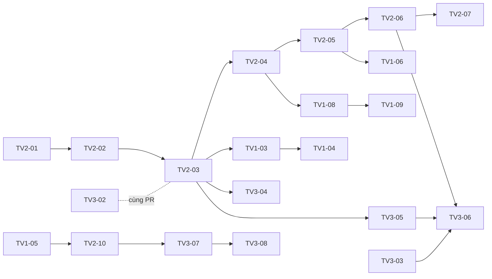

# Kế hoạch theo ticket

Chi tiết hoá [team-plan.md](../team-plan.md) thành các ticket nhỏ (1–3 ngày, diff ≤ ~400 dòng) để làm theo [quy trình vibe coding](../vibe-coding.md). Mỗi ticket ghi: tuần, phụ thuộc, mục spec, file, việc cần làm, tiêu chí xong, test, và **chỗ người phải review kỹ**.

- [TV1 – Form, PWA, màn hình dự án, staging](tv1-form-pwa.md)
- [TV2 – Đồng bộ, server, multi-tenancy](tv2-sync-server.md)
- [TV3 – Conflict UX, ảnh, export, kiểm thử](tv3-conflict-media-test.md)

## Nhãn

| Nhãn | Nghĩa |
|---|---|
| **Lõi** | Chạm bất biến trong CLAUDE.md. Viết test trước, hai người duyệt |
| **Người làm** | Không giao AI viết; AI chỉ gợi ý |
| **Cắt được** | Bỏ được nếu trễ (team-plan, thứ tự cắt) |

## Cách đánh dấu tiến độ

Đổi ô trạng thái trong bảng dưới **và** ở đầu ticket trong cùng PR hoàn thành ticket: `—` chưa làm, `⏳` đang làm (ghi tên nhánh), `✅` xong (ghi số PR).

## Bảng tổng

| Tuần | TV1 | TV2 | TV3 | Mốc |
|---|---|---|---|---|
| 1 | TV1-01 | TV2-01 | TV3-01 | Cả nhóm chạy được dự án, CI xanh |
| 2 | TV1-02, TV1-03 | TV2-02, TV2-03 | TV3-02, TV3-03 | Điền phiếu trong một dự án trên điện thoại thật |
| 3 | TV1-04, TV1-05 | TV2-04, TV2-05, TV2-06 | TV3-04, TV3-05 | Cách ly dự án có test xanh |
| 4 | TV1-06, TV1-07 | TV2-07, TV2-08 | TV3-06 | **Giữa kỳ:** hai dự án tách biệt, offline có ảnh |
| 5 | TV1-08, TV1-09, TV1-10 | TV2-09, TV2-10 | TV3-07 | |
| 6 | TV1-11 | TV2-11 | TV3-08 | Mọi ca conflict và cách ly có test |
| 7 | TV1-12 | TV2-12 | TV3-09, TV3-10 | Đóng băng giữa tuần |
| 8 | TV1-12 | TV2-12 | TV3-11 | **Cuối kỳ** |

## Trạng thái

| Ticket | Tên | Trạng thái |
|---|---|---|
| TV1-01 | Staging HTTPS | — |
| TV1-02 | Màn hình nhập mã đăng nhập | — |
| TV1-03 | Validate form + `POST P/forms` | — |
| TV1-04 | Form builder | — |
| TV1-05 | Validate phiếu + nháp | — |
| TV1-06 | Bộ chọn dự án | — |
| TV1-07 | Cập nhật SW, Cài đặt, kiểm tra trình duyệt | — |
| TV1-08 | Thành viên dự án (API + màn hình) | — |
| TV1-09 | Màn hình Dự án cho admin | — |
| TV1-10 | `formVersion`, `hidden`, xuất/nhập form | — |
| TV1-11 | E2E O2, O4, T6, T10 | — |
| TV1-12 | Hoàn thiện UI, tài liệu người dùng | — |
| TV2-01 | Migration + schema multi-tenancy | — |
| TV2-02 | Xác thực, `requireMember`, lớp `ctx` | — |
| TV2-03 | Route theo dự án + phạm vi pull | — |
| TV2-04 | `/api/me`, `/api/admin/projects` | — |
| TV2-05 | CSDL account + CSDL theo dự án, `api.ts` | — |
| TV2-06 | Sync nhiều dự án + Web Locks | — |
| TV2-07 | Cursor theo scope + thay đổi thành viên | — |
| TV2-08 | Idempotency hash, dọn key, fault `drop` | — |
| TV2-09 | Op `failed`, thử lại, cảnh báo tồn lâu | — |
| TV2-10 | Engine: khoá khi conflict, 409 lặp, bỏ qua nháp | — |
| TV2-11 | Hiệu năng pull | — |
| TV2-12 | Sửa lỗi, tài liệu kỹ thuật | — |
| TV3-01 | CI, `ENABLE_TEST_ROUTES`, unit test client | — |
| TV3-02 | CLI quản trị, fixture, sửa test theo API mới | — |
| TV3-03 | Nén ảnh | — |
| TV3-04 | Test cách ly T1–T5 | — |
| TV3-05 | Upload ảnh theo chunk (server) | — |
| TV3-06 | Hàng đợi upload ảnh (client) | — |
| TV3-07 | Màn hình conflict đầy đủ + chỉ đọc | — |
| TV3-08 | Xoá vs sửa | — |
| TV3-09 | Export CSV/JSON | — |
| TV3-10 | E2E O3, R4 | — |
| TV3-11 | Báo cáo kiểm thử | — |

## Phụ thuộc quan trọng

**Tuần 2 là điểm nghẽn:** TV2-03 + TV3-02 đổi toàn bộ đường dẫn API và thêm token. Trước khi PR đó merge, không merge PR nào khác chạm `server/src/routes/`. TV1 tuần 2 làm phần UI không phụ thuộc server (TV1-02 dùng stub, TV1-03 phần validate thuần).
